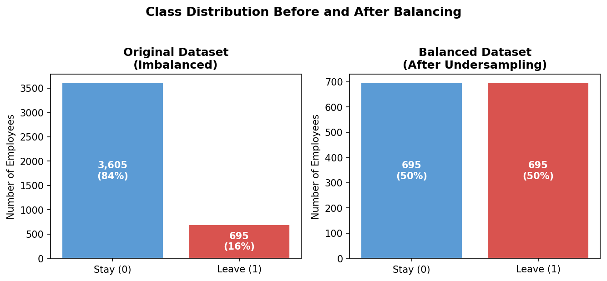
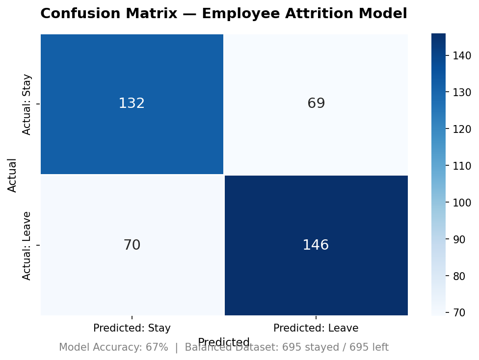
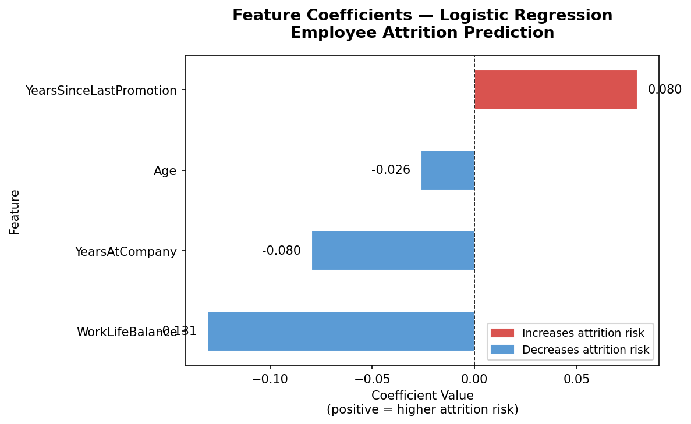

# Employee Attrition Prediction | Logistic Regression

**Course:** CSCI-5310  
**Tools:** Python | scikit-learn | pandas | Logistic Regression  
**Dataset:** [EDA-Analyzing the Attrition Rate of a Company — Anuj Biswas (Kaggle)](https://www.kaggle.com/datasets/anujachintyabiswas/attrition-rate-of-acompany/data)

---

## Objective

Can we predict whether an employee is likely to leave a company using a small set of interpretable HR variables? This project builds a logistic regression classifier to identify key drivers of employee attrition — providing actionable insights that HR teams and managers can directly act on to improve retention.

---

## Dataset

- **Source:** Kaggle — Public Domain License
- **Size:** 4,410 rows × 29 columns
- **Target variable:** `Attrition` — binary (Yes/No → 1/0)
- **Class imbalance:** 3,605 stayed (84%) vs. 695 left (16%)

---

## Methodology

### 1. Data Cleaning
- Removed rows with missing values using `dropna()`
- Encoded target variable: `Yes → 1`, `No → 0`

### 2. Handling Class Imbalance
The raw dataset had an 84:16 class imbalance — a naive model could achieve 84% accuracy by simply predicting "stay" every time, which is useless in practice.



To address this, the majority class was undersampled to create a **balanced 1:1 dataset (695:695)** without modifying the original data.

### 3. Feature Selection
Started with 10 theoretically motivated features, then iteratively refined to the 4 highest-signal variables:

| Initial 10 Features | Final 4 Features |
|---------------------|-----------------|
| Age | ✅ Age |
| DistanceFromHome | ❌ Removed |
| EnvironmentSatisfaction | ❌ Removed |
| JobSatisfaction | ❌ Removed |
| WorkLifeBalance | ✅ WorkLifeBalance |
| MonthlyIncome | ❌ Removed (removal improved accuracy) |
| YearsAtCompany | ✅ YearsAtCompany |
| YearsSinceLastPromotion | ✅ YearsSinceLastPromotion |
| YearsWithCurrManager | ❌ Removed |
| PercentSalaryHike | ❌ Removed |

### 4. Model Training
- **Algorithm:** Logistic Regression (`liblinear` solver)
- **Split:** 70% training / 30% testing
- **Why logistic regression over SVM?** Interpretability — coefficients directly quantify each variable's influence on attrition, making insights actionable for non-technical stakeholders

---

## Results

| Dataset | Accuracy |
|---------|----------|
| Imbalanced (original, 10 features) | ~84% (misleading) |
| Balanced (695:695, 10 features) | ~62% |
| Balanced (695:695, 4 features) | **~67%** ✅ |

### Confusion Matrix



- **132** employees correctly predicted to stay
- **146** employees correctly predicted to leave
- Balanced precision and recall across both classes confirms the model is genuinely learning patterns, not defaulting to the majority class

### Feature Coefficients



- **YearsSinceLastPromotion** is the strongest driver of attrition risk — employees who haven't been promoted recently are significantly more likely to leave
- **WorkLifeBalance** and **YearsAtCompany** are the strongest retention factors — longer tenure and better balance reduce attrition likelihood
- **Age** has a modest negative effect — older employees are slightly less likely to leave

---

## Key Findings

- Removing `MonthlyIncome` — counterintuitively — improved balanced accuracy, suggesting it added noise rather than signal in this simplified model
- The model is intentionally general (company-wide) but the same framework can be adapted to department-level models
- Logistic regression coefficients provide direct interpretability, making this model useful for HR stakeholders, not just data scientists

---

## Limitations

- **Undersampling** reduces the training dataset significantly (1,390 rows vs. 4,410 original) — SMOTE could be explored as an alternative
- 67% accuracy leaves room for improvement with ensemble methods (Random Forest, XGBoost)
- Features were selected based on domain knowledge; systematic feature importance analysis could surface additional predictors

---

## Python Packages Used

| Package | Purpose |
|---------|---------|
| `pandas` | Data loading, cleaning, and balancing |
| `scikit-learn` | Model training, evaluation, and splitting |
| `matplotlib` / `seaborn` | Output visualizations |

---

## Files

```
├── employee_attrition_model.py       # Full Python script
├── methodology_notes.md              # Model selection and feature philosophy
├── Attrition_data_original.csv       # Raw dataset (Kaggle, public domain)
├── images/
│   ├── confusion_matrix.png          # Model prediction results
│   ├── feature_coefficients.png      # Variable impact on attrition
│   └── class_balance.png             # Before/after undersampling
└── README.md
```

---

## References

- Biswas, A. (n.d.). *EDA-Analyzing the Attrition Rate of a Company*. Kaggle. https://www.kaggle.com/datasets/anujachintyabiswas/attrition-rate-of-acompany/data
- Pedregosa et al. (2011). *Scikit-learn: Machine learning in Python*. JMLR 12, 2825–2830.
